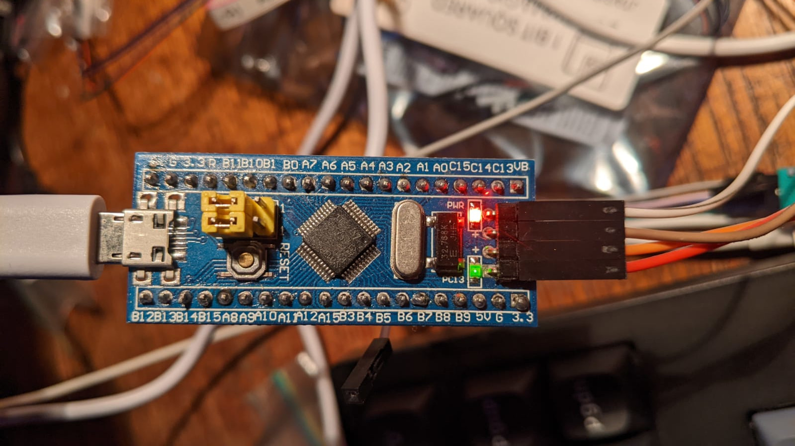
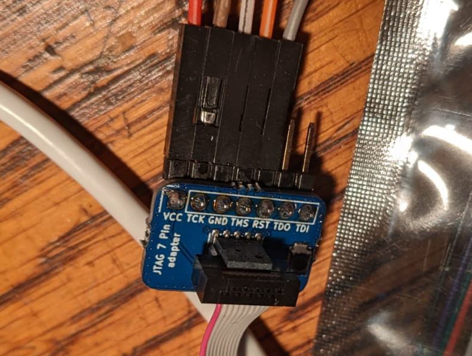

# embedded

Some simple test on a embedded devices
Initially **STM32F103C8T6** a.k.a. _Blue Pill_

## Connecting black magic probe (BMP) v23 to STM32F103C8T6 (blue pill)

So far using Single Wire Debugging (**SWD**)

On Linux add your user ${USER} to the dialout group to use the Black Magic Probe
(**BMP**)

```bash
sudo useradd ${USER} dialout
```

The blue pill needs external power. Since the project I am currently working on
is an USB Flight simulator, rudder pedals, I am using the USB cable

### Connections

| BMP | Bluepill | colour |
| --- | ---   | --- |
| vcc | 3.3v  | red |
| tck | swclk | brown |
| gnd | gnd   | white |
| tms | swdio | orange |
| rst | R (reset) | gray |

Once Black Magic Probe **BMP** and Blue Pill **BP** are powered up we should see

```bash
$>sudo dmesg

[  806.466354] usb 3-2: Product: Black Magic Probe v1.10.2
[  806.466357] usb 3-2: Manufacturer: Black Magic Debug
[  806.466361] usb 3-2: SerialNumber: 81C86B89
[  806.494701] cdc_acm 3-2:1.0: ttyACM0: USB ACM device
[  806.494865] cdc_acm 3-2:1.2: ttyACM1: USB ACM device

```


Blue Pill Gray (RST 4th pin top left), White (G), Brown (Clk), orange (swdio),
red (3.3V)


Black Magic Probe 10 pin adaptor

```bash
$> gdb-multiarch [elf arm32 file]
(gdb) target extended-remote /dev/ttyACM0
Remote debugging using /dev/ttyACM0
(gdb) monitor swdp_scan
Target voltage: 3.4V
Available Targets:
No. Att Driver
 1      STM32F1 medium density M3
(gdb) attach 1
(gdb) load
```
