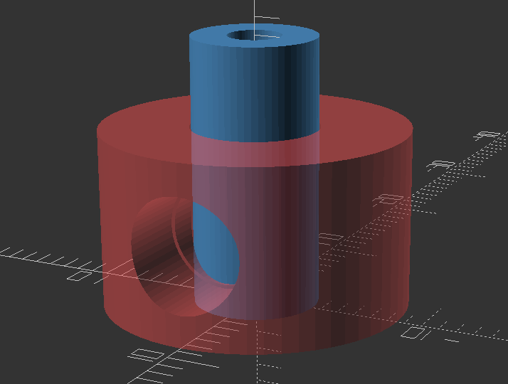

# RTIC ADC on Blue Pill #

## Summary ##

[RTIC](https://rtic.rs/2/book/en/)(Real Time Interrupt-driven Concurrency) provides an execution framework. It
does not provide any Hardware Abstraction Layer (HAL)

Analog Digital Converter (12 bit ADC) example using RTIC and the STM32F1xx HAL.

This examples uses probe-rs and STLink v2.3 with the last available firmware version
at the time of writing to support Real-Time Transfer (RTT). 
RTT is used to stream debug logs and data with a non-blocking protocol.

## Analog Digital Converter (ADC) using:

* 10K Ohm potentiometer connected to __PA0__ (To compare to)
* Allegro _ALS31001LUAA_ Hall effect sensor connected to ___PA1___
* pa0-pa7, pb0, pb1 for analog input connected to ADC0 (12 bits per ch)

## Compile and run ##

```bash
# Build
cargo build --bin adc0 --release
# Run (using RTT)
cargo run --bin adc0 --release
```

[RTIC](https://rtic.rs/2/book/en/)

● [ALS31001 3.3v Hall Effect](<https://www.allegromicro.com/-/media/files/datasheets/als31001-datasheet.pdf>) connected as:

```bash
  VCC ──┬── sensor Pin 1 (3.3V)
        └── 100 nF ── GND (104M) ← bypass cap here (C_BYPASS)  

  Pin 2 (GND)

  Sensor Pin 3 (VOUT) ── 1 kΩ ── PA1 ← series resistor for ESD  
                                  │  
                                ≤ 0.22 nF (optional 221K) ── GND  
```

## Current settings ##

  PA1 = 2126 at quiescent is right on target — that's 1.71 V against a typical
  QVO of 1.65 V, well within the sensor's ±1.5% ratiometry spec.  
  Full ±1200 count swing when you move the magnet depends on the
  magnetic field (__1.8 mV/G__ from datasheet)

## Send HID info to USB as HID ##

 Analog inputs (12bits) shifted 4 bits to the left and sent as 10 ch (16 bits)
 joystick HID report (20 bytes) to USB host using the `usbd-hid` crate.

## Jig for sensor and magnets for testing

Uses [OpenSCAD](https://openscad.org/) for 3D CAD modelling. 
At this stage only the sensor/magnet jig interaction for testing and calibration.



I should have captured the axes :-( . Next time!

      z        The blue rod in the z axis carries the hall effect sensor
      |        The Coral disk moves around the blue rod freely
      |__ x    The disc holes in the y axis carries the magets 
     /
    y

## A bit of fiddling around with code and 3D jigs

1. A few small changes to the code to spit the HID to something that resembles a Joystick, so the data can be detected.
1. A single 3D file with two printable elements (Open Scad) to change the magnetic field around the hall effect sensor.
1. A bit of the initial capture of the sensor data output to plot and adjust. The rotation around the _z_ axis where the sensor is is well controlled, but the jig still allows some unwanted translation, of the sensor, along _z_ as well. To be corrected in a following version of the Jig

## Jupyter lab

Looking into the sensor data output captured with [GilRs](https://docs.rs/gilrs/latest/gilrs/) pad library

Install and setup uv and jupyterlab and dependencies to look into the data.

```bash
>$ uv init
Initialized project `rtic-hid`

>$uv add jupyterlab pandas numpy
Using CPython 3.14.6 interpreter at: /usr/bin/python3.14
Creating virtual environment at: .venv
...
>$ uv add --dev ipykernel
Resolved 97 packages in 10ms
Checked 93 packages in 0.86ms

>$ uv run python -m ipykernel install --user --name=rtic-hid --display-name "Python (rtic-hid)"
Installed kernelspec rtic-hid in /home/daniel/.local/share/jupyter/kernels/rtic-hid

>$ uv run jupyter lab
```
```
```
